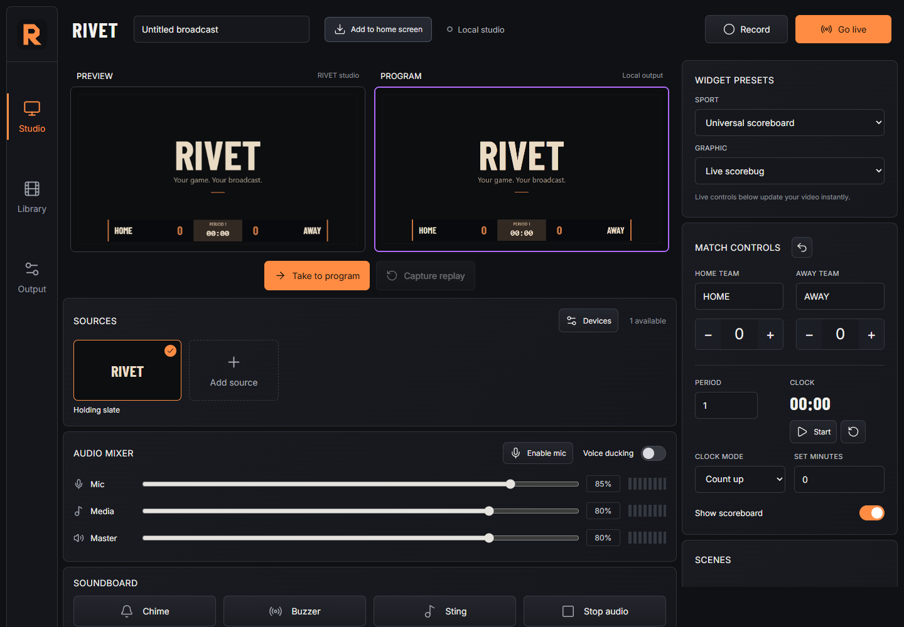

# RIVET

**Your phone is the broadcast truck.** RIVET is an offline-first sports production studio for capable Android phones and Linux. It combines camera and media sources, interactive sports graphics, scenes, audio mixing, local recording, instant replay, transcoding, and optional multistream output in one local tool.



## Install on Android

Install a current Termux build, open it, and run:

```sh
curl -fsSL https://raw.githubusercontent.com/Devi8d0ne/RIVET/main/install.sh | bash
```

The installer adds the required Termux packages, Ubuntu PRoot, Python, FFmpeg, the RIVET runtime, `~/start-rivet`, and the Termux:Widget shortcut file. Initial package setup needs internet. Local production and transcoding work offline afterward.

To install from downloaded release files instead, keep the installer, archive, and checksum together, then run:

```sh
bash ./install-rivet-termux.sh --launch
```

Open `http://127.0.0.1:8787/` in Android Chrome and install the PWA when prompted. The installed studio requests landscape orientation for the production layout.

## What it does

- Preview/program switching with multiple cameras, local video, audio, images, screen capture where supported, and picture-in-picture.
- Saved multi-source scenes with explicit Program, Preview, and cycle order.
- Interactive scoreboards for basketball, American football, soccer, pool/billiards, and general use.
- Local recording, replay capture, browser recovery, and an offline FFmpeg MP4 conversion queue.
- One H.264/AAC encode fanned out to one to four RTMP/RTMPS destinations.
- Explicit stream-key setup for YouTube, Facebook Live, Twitch, Kick, and custom RTMP servers.
- Optional Qualcomm Android hardware encoding after device-specific verification.

RIVET never starts a broadcast because a network becomes available. The operator configures destinations and presses **Go live**.

## Recommended Android baseline

- Flagship-class Android phone; Samsung Galaxy Z Fold5 is the current development device.
- Android 12 or newer.
- 8 GB RAM.
- At least 10 GB free storage, plus room for recordings.
- Current Chromium-based Android browser.
- External power and a cooling plan for long events.

These are starting recommendations, not a blanket compatibility claim. Validate camera behavior, sustained frame rate, heat, battery use, storage, and audio synchronization for the full event length you need.

## Architecture

The Android browser owns camera and microphone permission and renders the production UI. A loopback-only Python service inside Termux Ubuntu stores media and manages FFmpeg conversion and live output. Runtime assets contain no CDN, cloud-account, or remote-AI dependency.

```text
Android browser · 127.0.0.1:8787
  camera + microphone + media + graphics
                    ↓
          compositor + audio mixer
              ├─ local recording
              ├─ replay and library
              └─ one local encode → up to four RTMP(S) destinations
```

## Build and test

```sh
npm --prefix rivet ci
npm --prefix rivet run build
python -m unittest discover -s rivet/tests -p "test_*.py"
node --test rivet/tests/test_capture.mjs
python -m unittest tests.test_rivet_packaging
python scripts/package-rivet.py releases/rivet-0.1.0-linux.tar.gz
```

Node is needed to build the frontend. End users run the packaged static assets with Python and FFmpeg.

## Security

The service binds to loopback only. Stream keys stay in the current browser session and are never returned in status responses or request logs. Treat stream keys and signed upload URLs as passwords. See [SECURITY.md](SECURITY.md) for responsible disclosure.

## Contributing

Issues and focused pull requests are welcome. Start with [CONTRIBUTING.md](CONTRIBUTING.md), and include the Android/browser/hardware combination used for device reports.

## License

RIVET is licensed under the GNU General Public License v2.0. See [LICENSE](LICENSE).
